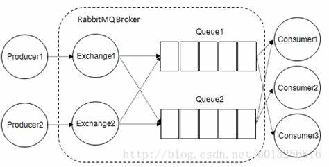

### RabbitMq
#### 1,RabbitMq简介
##### 1.1 什么是消息队列中间件（Message Queue Middleware,简称MQ）？
    是指利用高效可靠的消息传递机制进行与平台无关的数据交流，并基于数据通信来进行分布式系统的集成。
说明白点就是实现了消息传递的媒介，异步通信成为了可能。<br/>
#### 1.2 消息中间件作用
```
解耦,存储，扩展性，削峰，可恢复性，缓冲，异步通信。
```
##### 1.3 安装
1.3.1 安装Erlang
```
```
1.3.2 RabbitMq的安装
```
tar zxvf rabbitmq-server-generic-unix-3.6.10.tar.gz -C /opt
cd /opt(安装目录）
mv rabbitmq-server-generic-unix-3.6.10 rabbitmq
export PATH=$PATH:/opt/rabbitmq/sbin
export RABBITMQ_HOME=/opt/rabbitmq
source /etc/profile
```
1.3.3 测试
```
后台启动服务
rabbit-mq -detached
查看状态
rabbitmqctl status
```
#### 2,RabbitMq的概念
2.1 RabbitMq整体上是一个生产者与消费者模型，负责接收，存储和转发消息。

2.2 队列
RabbitMq的队列用于存储消息,和Kafka相反。生产者和消费者从队列中生产和消费消息。
多个消费者可以订阅同一个队列，这时候队列的消息会被轮询给多个消费者消费。<br/>
2.3 交换器,路由键,绑定
Exchange：交换器，2.2我们暂时理解成生产者生产消息到队列，实际上RabbitMq中是生产者生产消息发送到Exchange，由交换器路由消息到要给或者多个队列中。
路由失败，返回消息给生产者，或者直接丢弃。<br/>
下面看看来看看四种交换器类型：<br/>
```
1,fanout
会把所有发送到该交换器的消息路由到所有与该交换器绑定的队列中
2,direct
会把消息路由到那些BindingKey和RoutingKey完成匹配的队列中
3,topic
与direct类似，不同的是有一些约定：
RoutingKey为一个点号"."分隔的字符串，
BindingKey和RoutingKey一样也是点号"."分隔的字符串
BindingKey中可以存在两种特殊字符串"*"和'#",用于做模糊匹配，其中'*"用于匹配一个单词，
"#"用于匹配多规格单词(可以是零个）
4,headers
根据消息的headers匹配队列和交换器绑时指定的键值对来决定发送哪个队列。
```
RoutingKey：路由建。用来指定这个消息的路由规则。必须和BindingKey联合使用<br/>
Binding:绑定

    
